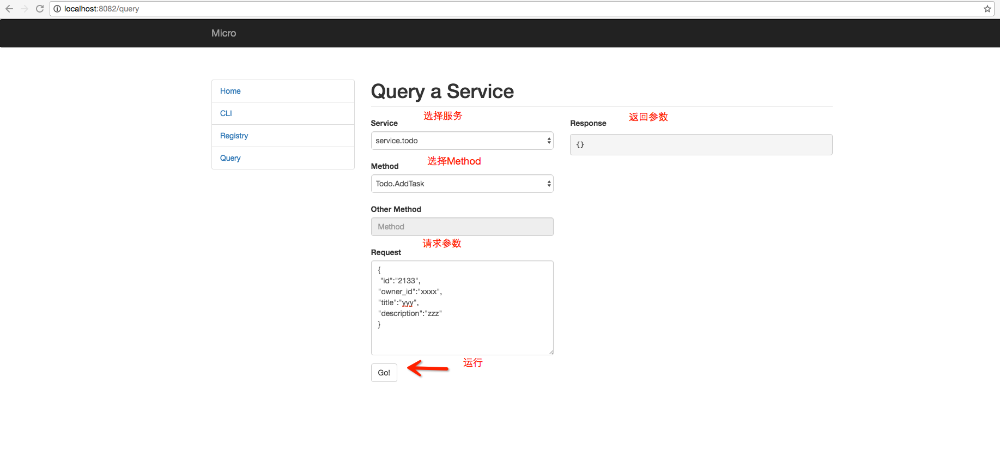

# micro-practice
go-micro框架demo

## Getting Started

#### Install Consul

[https://www.consul.io/intro/getting-started/install.html](https://www.consul.io/intro/getting-started/install.html)

#### Run Consul

$ consul agent -dev -advertise=127.0.0.1

#### 运行服务

在micro-practice/chunzuan_demo/proto目录下执行如下命令:

前提需要安装protoc编译器:[https://blog.micro.mu/2016/03/28/go-micro.html](https://blog.micro.mu/2016/03/28/go-micro.html)
go get github.com/micro/protobuf/{proto,protoc-gen-go}
protoc --go_out=plugins=micro:. *.proto

在micro-practice/chunzuan_demo目录下运行服务:
➜  chunzuan_demo ./chunzuan_demo

#### 测试

➜  ~ micro web

在浏览器地址栏中输入:http://localhost:8082

